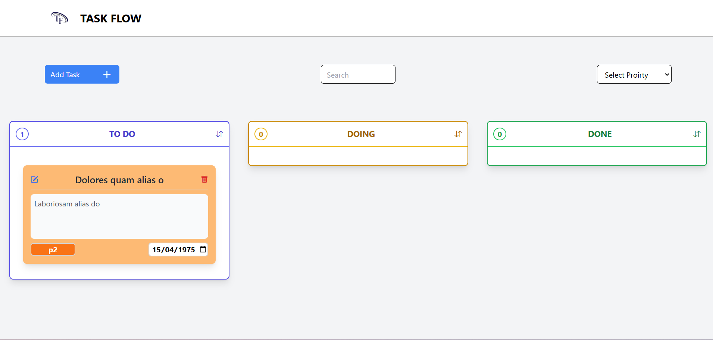

# TaskFlow

## Contexte du projet
TaskFlow est une application de gestion de tâches développée pour aider les utilisateurs à créer, suivre et organiser leurs tâches de manière efficace. L'application vise à améliorer la productivité de l'équipe de développement en fournissant une interface moderne et intuitive.

## Fonctionnalités
- **Page d'accueil** : Présentation de la To Do List avec une interface soignée utilisant Tailwind CSS.
- **Ajout de tâches** : Modal permettant d'ajouter de nouvelles tâches avec des champs pour le titre, la description, le statut, la date d’échéance et la priorité.
- **Affichage des tâches** : Liste organisée affichant le titre, la date d’échéance et la priorité visuelle des tâches.
- **Changement de statut** : Possibilité pour les utilisateurs de changer le statut d'une tâche.
- **Statistiques des tâches** : Affichage du nombre total de tâches différentes.
- **Suppression de tâches** : Fonctionnalité pour supprimer des tâches existantes.
- **Validation des formulaires** : Vérifications d'intégrité des informations saisies avant l'ajout des tâches.
- **Dynamisme** : Utilisation de JavaScript pour des animations d'ajout et de suppression de tâches.
- **Accessibilité** : Conformité aux critères d'accessibilité pour une utilisation par tous.
- **Déploiement** : Application déployée en ligne via GitHub Pages ou Vercel.

### 
- **Ajout multiple de tâches** : Modal permettant d'ajouter plusieurs tâches à la fois.
- **LocalStorage** : Sauvegarde des modifications pour un accès ultérieur.
- **Modification des tâches** : Fonctionnalité pour modifier des tâches existantes.
- **Tri et filtrage** : Options pour trier et filtrer les tâches par date d'échéance ou priorité.
- **Recherche de tâches** : Barre de recherche pour trouver rapidement des tâches par titre ou mot-clé.
- **Tri automatique** : Algorithme pour trier les tâches par date d'échéance ou priorité.

## Installation
1. Clonez le dépôt :
   ```bash
   git clone https://github.com/Youcode-Classe-E-2024-2025/amine_sabri_Task_Flow

   

   ## License
lien de projet  [project link](https://youcode-classe-e-2024-2025.github.io/amine_sabri_Task_Flow/)

